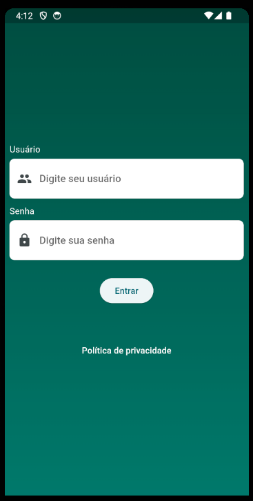
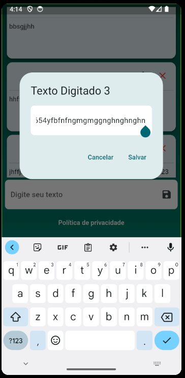

# Projeto de Prova Flutter para a Target Sistemas

Este é um projeto de exemplo criado como parte de uma prova para a empresa Target Sistemas. O projeto foi desenvolvido em Flutter, uma estrutura de desenvolvimento de aplicativos multiplataforma.

## Visão Geral do Projeto

O objetivo deste projeto é demonstrar minhas habilidades e conhecimentos em Flutter e programação.

### Recursos Principais
- Shared_preferences
- mobX

## Capturas de Tela

